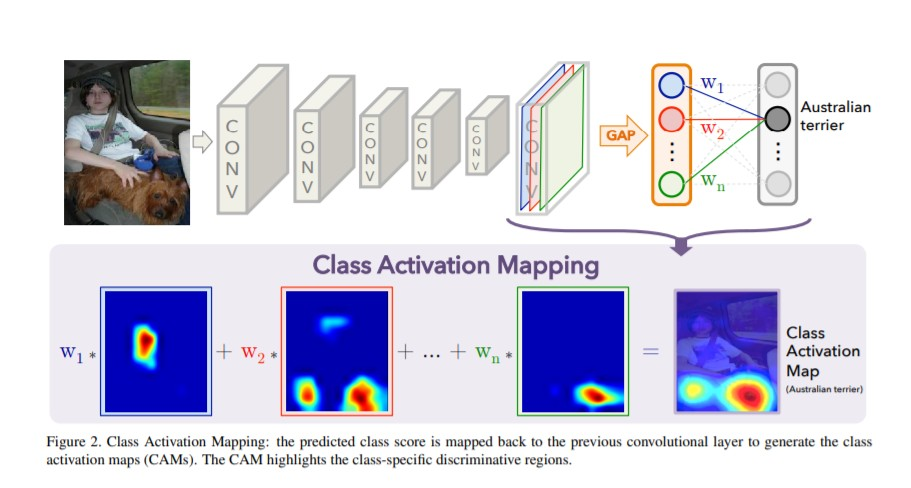

##Keras implementation of class activation mapping(CAM) based on ResNet

This project implements class activation maps with Keras, and the backbone is ResNet.


#Quickstart
To fine-tune your model, you should define your dataset first, and then:
```bash
python train.py
```
To have a visulisation of the heatmap of cam, you just need to:
```bash
python visulization.py
```  

#Tips
* To run this code, please define your own dataset, and feel free to get a fine-tune.
* If you want to use other models instead, please change the model in function of `get_model`. You can choose your backbone in [`tf.keras.applications`](https://tensorflow.google.cn/api_docs/python/tf/keras/applications?hl=en). However, do not forget to change the code of dropping dense layer (the position of the last conv layer is different) and the input image size.
